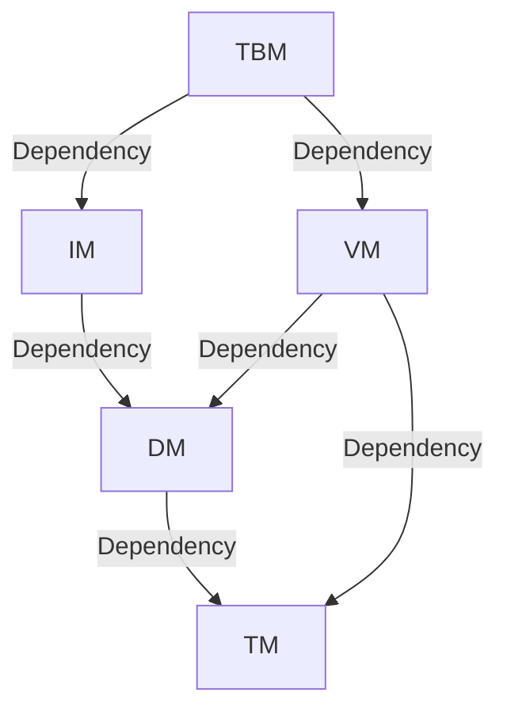

# Simple DB
______
- Data reliability and data recovery 
- Two-stage locking protocol (2PL) implements serializable scheduling and MVCC
- Two transaction isolation levels (read committed and repeatable read)
- Deadlock handling 
- Simple table, field management and SQL parsing
- Socket-based server and client
## How to start
______
### Pre-requirement
- OpenJDK 11
- Apache Maven 3.9.5 
### Shell
- step1 
    ```bash
    chmod +x ./start-server.sh ./start-client.sh
    ```
- step2  
    ```bash
    ./start-server.sh
    ./start-client.sh   
    ```
## Dependency graph
______

## Transaction Manager
______
### Transaction Manager
- builder pattern
- responsible for state of transaction
- maintaining a file starting with a `xid`
## Data Manager
______
### Abstract Cache
- template pattern
- reference counting
### Logger
- iterator pattern
- format
    - log file: `[Xchecksum][log1][log2][log3]...[logN][BadTail]`
    - log: `[Size][Checksum][Data]`
    - data
        - update: `[DataType: 1byte][Xid: 8bytes][Uid: 8bytes][OldRaw][LatestRaw]`
            - uid: `[PageNumber: 4bytes][Offset: 4bytes]`
        - insert: `[DataType: 1byte][Xid: 8bytes][PageNumber: 4bytes][Offset: 2bytes][Raw]`
- process
  - redo: scan log and process redo logs which state is committed
  - undo: scan log and process undo logs which state is active reversely
  - logging
    1. wrap data to log
    2. write log to log file
    3. update check sum
    4. flush to disk
### Page
- format
  - level1 page 
    - when db start up, write random bytes from `OF_VC` to `OF_VC + LEN_VC - 1` byte
    - when db close, copy random bytes from `OF_VC + LEN_VC` to `OF_VC + 2 * LEN_VC - 1` byte
    - used to determine whether the database was shut down normally in the last time
  - secondary page
    - `[Offset: 2bytes][Raw]`
    - stored FSO (free space offset)
    - used to process raw data as secondary page when page cache need it in the process of initialization of DataManager
### Page Index
- splitting the secondary page into four-ty slots
  > the page index caches the free space of each page, it is used to quickly find a page with suitable space when the upper module performs an insertion operation without checking the information of each page from the disk or cache.
### Data Item
- format
  - data item: `[ValidFlag: 1byte][DataSize: 3bytes][Raw]`
### Data Manager
- feature: providing data accessing service for the upper layer, eg: vm, im
- method
  - insert()
  - read()
  - update()
## Index Manager
______
### Index Manager
- format
  - Node: `[NumberOfKeys][SiblingUid][Son0][Key0][Son1][Key1]...[SonN][KeyN]`
- insert()
  1. assume `BALANCE` is `3`
      ```mermaid
          graph TD
      A(root) --> B(4)
      A --> C(7)
      A --> D(10)
      A --> E(13)
      B --> F(1)
      B --> G(2)
      B --> H(3)
      C --> I(4)
      C --> J(5)
      C --> K(6)
      D --> L(7)
      D --> M(8)
      D --> N(9)
      E --> O(10)
      E --> P(11)
      E --> Q(12)
      A --> U(MAX)
      U --> R(13)
      U --> S(14)
      U --> T(15)
      U --> V(16)
      U --> W(17)
      ```
  2. after insert `18`, `MAX` will be split, `16` will be created for `13, 14, 15`, then `MAX` will be created for `16, 17, 18`
     ```mermaid
          graph TD
          A(root) --> B(4)
          A --> C(7)
          A --> D(10)
          A --> E(13)
          B --> F(1)
          B --> G(2)
          B --> H(3)
          C --> I(4)
          C --> J(5)
          C --> K(6)
          D --> L(7)
          D --> M(8)
          D --> N(9)
          E --> O(10)
          E --> P(11)
          E --> Q(12)
          A --> U(MAX)
          U --> R(13)
          U --> S(14)
          U --> T(15)
          U --> V(16)
          U --> W(17)
          U --> X(18)
     ```
     ```mermaid
          graph TD
          A(root) --> B(4)
          A --> C(7)
          A --> D(10)
          A --> E(13)
          B --> F(1)
          B --> G(2)
          B --> H(3)
          C --> I(4)
          C --> J(5)
          C --> K(6)
          D --> L(7)
          D --> M(8)
          D --> N(9)
          E --> O(10)
          E --> P(11)
          E --> Q(12)
          A --> Y(16)
          Y --> R(13)
          Y --> S(14)
          Y --> T(15)
          U(MAX) --> V(16)
          U --> W(17)
          U --> X(18)
     ```
  3. `MAX` will be inserted into `root`, so the number of son of `root` exceed limitation
  4. `root` will be split, then another one `MAX` created
     ```mermaid
          graph TD
          A(root) --> B(4)
          A --> C(7)
          A --> D(10)
          B --> F(1)
          B --> G(2)
          B --> H(3)
          C --> I(4)
          C --> J(5)
          C --> K(6)
          D --> L(7)
          D --> M(8)
          D --> N(9)
          E --> O(10)
          E --> P(11)
          E --> Q(12)
          Y --> R(13)
          Y --> S(14)
          Y --> T(15)
          U(MAX) --> V(16)
          U --> W(17)
          U --> X(18)
          Z(MAX) --> E(13)
          Z --> Y(16)
          Z --> U
     ```
  5. create a `newRoot` and replace old root with it
     ```mermaid
     graph TD
     A(13) --> B(4)
     A --> C(7)
     A --> D(10)
     B --> F(1)
     B --> G(2)
     B --> H(3)
     C --> I(4)
     C --> J(5)
     C --> K(6)
     D --> L(7)
     D --> M(8)
     D --> N(9)
     E --> O(10)
     E --> P(11)
     E --> Q(12)
     U --> R(13)
     U --> S(14)
     U --> T(15)
     W --> X(16)
     W --> Y(17)
     W --> Z(18)
     V(MAX) --> E(13)
     V --> U(16)
     V --> W(MAX)
     newRoot --> A
     newRoot --> V
     ```
- search()
## Version Manager
______
### Version Manager
- two-phase locking & multi-version concurrency control
- deadlock detection by depth first search
- format
  - entry: `[Xmin][Xmax][Data]`
## Table Manager
______
### Parser
- lexical parser and grammar parser
- finite state machine
  ```mermaid
    graph TD
    INIT -->|Symbol| IN_SYMBOL
    INIT -->|QuoteChar| IN_QUOTE
    INIT -->|Alphabet/Digit| IN_TOKEN
    IN_SYMBOL -->|Any| INIT
    IN_QUOTE -->|Any| IN_QUOTE
    IN_QUOTE -->|QuoteChar| INIT
    IN_TOKEN -->|Alphabet/Digit| IN_TOKEN
    IN_TOKEN -->|Blank| INIT
  ```
### Table Manager
- format
  - field: `[FieldName][TypeName][IndexUid]`
    - `[StringLength][StringData]`
  - table: `[TableName][NextTable][Fiedl1Uid][Field2Uid]...[FieldNUid]`
- safe/atomic update of files via temporary files
  > ref: https://mozillazg.com/2018/05/a-way-to-atomic-write-or-safe-update-a-file.html
- when creating a new table, the header interpolation method is used, so the Booter file needs to be updated every time a table is created.
## Transport
______
### C/S
- A special binary format is used for communication between the client and the server. 
- In order to avoid problems caused by special characters, the data will be converted into a hexadecimal string (Hex String).
